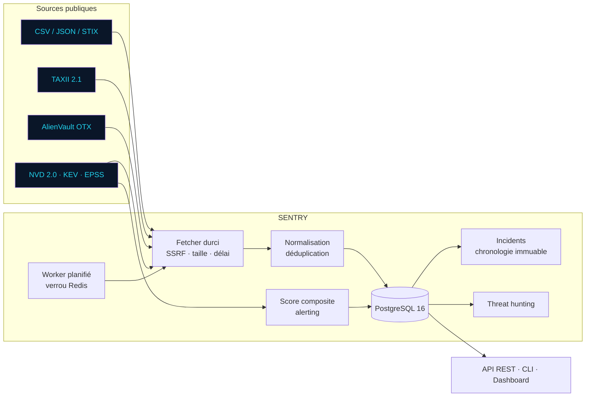

<div align="center">

<picture>
  <source media="(prefers-color-scheme: dark)" srcset="docs/assets/sentry-logo-dark.svg">
  
</picture>

**Security Monitoring & Cyber Threat Intelligence Platform**

*CyberillSec — A CYBERILL Initiative*

[](https://github.com/GodwillFoka/cyberillsec-sentry/actions/workflows/ci.yml)
[](https://github.com/GodwillFoka/cyberillsec-sentry/actions/workflows/validation-reelle.yml)
[](https://godwillfoka.github.io/cyberillsec-sentry/)
[](https://github.com/GodwillFoka/cyberillsec-sentry/releases)
[](https://github.com/GodwillFoka/cyberillsec-sentry/pkgs/container/cyberillsec-sentry)
<br>
[](pyproject.toml)
[](LICENSE)
[](https://www.python.org/)
[](pyproject.toml)
[](https://oasis-open.github.io/cti-documentation/)

*« Engineering Cyber Resilience. Empowering Digital Trust. »*

[**📖 Documentation**](https://godwillfoka.github.io/cyberillsec-sentry/) ·
[Démarrage rapide](#démarrage-rapide) ·
[Déploiement](#déploiement) ·
[Feuille de route](#feuille-de-route) ·
[Rapports](https://godwillfoka.github.io/cyberillsec-sentry/rapport/)

Dépôts : [GitLab (référence)](https://gitlab.com/GodwillFoka/cyberillsec-sentry) · [GitHub (miroir)](https://github.com/GodwillFoka/cyberillsec-sentry)

</div>

---

## En 30 secondes

SENTRY est une plateforme de **Cyber Threat Intelligence** open source qui fait le travail
répétitif d'un analyste SOC — collecter, dédupliquer, prioriser, corréler — pour qu'il ne garde
que les décisions :

- **collecte** en continu le renseignement public : CSV, JSON, STIX 2.1, **TAXII 2.1**,
  AlienVault OTX, NVD 2.0, CISA KEV, FIRST EPSS ;
- **normalise et déduplique** les indicateurs de compromission (IOC) en gardant leur provenance ;
- **priorise** chaque vulnérabilité sur un **score déterministe de 0 à 100** fondé sur
  l'exploitation réelle, et alerte quand une CVE franchit le seuil ;
- **pilote la réponse** : incidents NIST SP 800-61 à chronologie **immuable**, ouverts en un clic
  depuis une alerte ;
- **chasse** les menaces dans les journaux d'une organisation (Tor, DNS dynamique, DGA,
  infrastructures ransomware, CVE exploitables sur l'inventaire) ;
- **expose** tout cela par une API REST (35 opérations), une CLI riche (40 commandes) et un tableau
  de bord SOC, dans **moins de 256 Mo de mémoire**.

## État du projet

| | |
|---|---|
| **Version** | `0.2.0.dev0` sur `main` · dernière release : [`v0.1.1`](https://github.com/GodwillFoka/cyberillsec-sentry/releases) (baseline M1–M6) |
| **Intégré dans `main`** | M1 → M6 (six modules) **et** M7 « Production Hardening » (lots 1 à 3) |
| **Vérifié en continu** | CI à chaque push (qualité, 438 tests sur PostgreSQL réel, migrations, image, sécurité) ; **validation sur données réelles** chaque lundi (flux IOC, KEV, NVD, EPSS, scénario SOC complet) |
| **Jalons constatés** (`sentry status`, 06/10) | M1 ✅ · M2 ◐ (volume et sources ✅, OTX et STIX attendent leurs clés) · **M3 ✅** · M4 ✅ · M5 ✅ (scénario SOC) · M6 ✅ |
| **Prochaine étape** | Préproduction sur un VPS européen (clôture de M7), puis M8 « Detection & Correlation » |
| **Dernier rapport** | [`Rapport/03_06-10-2026.md`](Rapport/03_06-10-2026.md) |

## Le problème

Un analyste SOC passe 60 à 70 % de son temps à recopier des indicateurs entre une dizaine
d'outils, à lire des bulletins illisibles et à trier des alertes en double. Les plateformes
commerciales qui résolvent ce problème coûtent de **40 000 à 150 000 € par an** — hors de portée
des PME, des ETI et des collectivités. Les plateformes open source complètes exigent une
infrastructure lourde : OpenCTI, par exemple, demande au minimum **8 Go de RAM pour la plateforme
et 8 Go pour son moteur de recherche**, plus Redis, RabbitMQ et un stockage objet¹.

Pendant ce temps, les attaquants exploitent une vulnérabilité publiée en moins de 48 heures, et
**NIS 2** et **DORA** imposent une veille active et une notification d'incident sous 24 à 72 h.

## La réponse

| | Plateformes commerciales | Plateformes open source complètes | **SENTRY** |
|---|---|---|---|
| Coût annuel | 40 à 150 k€ | 0 € (hors infrastructure) | **0 €** |
| Licence | Propriétaire | AGPL / Apache | **MIT** |
| Infrastructure | SaaS hors UE le plus souvent | ≥ 16 Go de RAM, 4 à 5 services | **< 256 Mo, PostgreSQL + Redis** |
| Priorisation CVE par l'exploitation réelle | Oui | Via connecteurs | **Native (KEV + EPSS + exploit)** |
| Souveraineté | Variable | Auto-hébergé | **Auto-hébergé, UE** |

SENTRY ne cherche pas à remplacer un graphe de connaissances CTI complet : il donne à une
équipe de 1 à 10 personnes ce dont elle a besoin **le lundi matin** — quoi patcher d'abord, quoi
bloquer, qu'est-ce qui a changé, et la preuve de ce qui a été fait.

## Fonctionnalités

| Module | Ce qu'il fait | État |
|---|---|---|
| **MOD-01 Foundation** | Configuration validée au démarrage, PostgreSQL + Alembic, JWT + Argon2id, rôles ADMIN / ANALYST / VIEWER, limitation des tentatives de connexion | ✅ opérationnel |
| **MOD-02 Threat Feeds** | 5 formats de flux, client TAXII 2.1 `taxii2-client` durci, connecteur OTX, sonde de source avant intégration, déduplication, expiration par type, provenance multi-sources, worker planifié avec verrou Redis | ✅ intégré · 4 sources réelles saines, 3 865 IOC (06/10) ; OTX et STIX attendent leurs clés |
| **MOD-03 CVE Tracker** | NVD 2.0 incrémental, catalogue KEV, EPSS, score composite recalculé à chaque changement, historique de priorité, alertes + webhook | ✅ **jalon M3 atteint sur données réelles** (06/10) : 1 734 KEV, 9 132 CVE NVD, EPSS sur 97 % |
| **MOD-04 Incidents** | Cycle NIST SP 800-61 à 6 états, chronologie immuable (ORM + déclencheur PostgreSQL), liens IOC/CVE, incident depuis une alerte | ✅ jalon atteint sur données réelles |
| **MOD-05 SOC Dashboard** | Synthèse temps réel, activité 24 h, MTTR, exports CSV RFC 4180 / JSON RFC 8259 protégés contre l'injection CSV | ✅ intégré · scénario réel validé |
| **MOD-06 Threat Hunting** | 6 règles déterministes, chasse sur observables ou sur la base, sessions enregistrées, chasse planifiée | ✅ jalon atteint sur données réelles |

« Codé » signifie : implémenté, testé, intégré au pipeline. Un jalon n'est déclaré **atteint**
que lorsque `sentry status` le constate sur données réelles.

## Score de risque composite

Le cœur de SENTRY. Pour chaque CVE :

```
R = min(100, CVSS × 3.0 + EPSS × 100 × 0.25 + KEV × 25 + Exploit × 10 + Ransomware × 10)
```

| Composante | Source | Contribution max |
|---|---|---|
| CVSS v3.1 — sévérité technique | NVD 2.0 | 30 |
| EPSS — probabilité d'exploitation à 30 jours | FIRST | 25 |
| Exploitation avérée | CISA KEV | 25 |
| Exploit public documenté | Références NVD « Exploit » | 10 |
| Campagne ransomware confirmée | CISA KEV | 10 |

**R ≥ 80** → P0, patch sous 24 h · **60 ≤ R < 80** → P1, 7 j · **40 ≤ R < 60** → P2, 30 j ·
**R < 40** → P3. Une CVSS 10.0 sans exploitation observée plafonne à 30 et ne réveille personne
la nuit : c'est l'exploitation réelle qui pilote la priorité. Chaque point est justifiable
(`GET /api/v1/cves/{id}` → `breakdown` et `history`) — voir [ADR-001](docs/adr/ADR-001-scoring-composite.md).

## Architecture



Clean Architecture en couches strictes : les contrôleurs (API FastAPI, CLI Click) ne contiennent
aucune logique métier ; tout passe par `sentry/modules/`, testable sans HTTP ni base. Détail :
[`docs/ARCHITECTURE.md`](docs/ARCHITECTURE.md) et les [15 décisions d'architecture](docs/adr/README.md).

## Sécurité par conception

Une plateforme de sécurité qui télécharge des données hostiles doit être la première à s'en
protéger.

| Risque | Mesure |
|---|---|
| **SSRF** (une URL de flux qui vise le réseau interne) | Liste blanche d'adresses publiques (`is_global`, CGNAT, NAT64, 6to4), résolution DNS vérifiée avant chaque requête, redirections revalidées ou refusées |
| Réponse hostile (taille, lenteur) | Lecture en flux plafonnée, délai par requête, backoff exponentiel, 429 respecté |
| Fuite de secrets | Clés jamais en base (gabarits `{ABUSECH_AUTH_KEY}`, en-têtes), masquées dans erreurs et journaux, identifiants TAXII attachés à un seul hôte |
| Force brute | 429 avant toute vérification du mot de passe : 5 échecs d'une adresse sur un compte, 50 sur un compte (botnet), 20 d'une adresse (pulvérisation) — sans verrouiller le titulaire légitime |
| Falsification de l'historique | Chronologie d'incident et journal d'audit refusant `UPDATE`, `DELETE` et `TRUNCATE` jusque dans PostgreSQL (déclencheurs) |
| Répudiation | Journal d'audit : connexions, refus d'accès, tentatives SSRF, administration, exports, chasse — acteur, IP, `X-Request-ID` |
| Vol de session | Accès de 15 min, jeton de rafraîchissement opaque et rotatif : un rejeu révoque toute la session ; `sentry users disable` coupe l'accès immédiatement |
| Compromission du code applicatif | Rôle PostgreSQL applicatif sans droit de structure : ni `ALTER`, ni `TRUNCATE`, ni suppression de déclencheur ; tables d'audit en `SELECT/INSERT` seulement |
| Exposition HTTP | CSP `default-src 'none'`, `nosniff`, `X-Frame-Options`, `no-store`, HSTS et `/docs` masqué en production, erreurs 500 sans détail interne |
| Injection CSV (CWE-1236) | Cellules exportées commençant par `= + - @` neutralisées |
| Élévation de privilèges | RBAC sur chaque route d'écriture, rôle relu en base à chaque requête |
| Chaîne d'approvisionnement | Versions figées (`constraints.txt`) pour la CI, l'image et le poste ; SAST, secrets et dépendances analysés à chaque pipeline ; Renovate |
| Conteneur | Utilisateur non privilégié (UID 10001), contexte de build sans `.env`, image analysée à chaque pipeline (Container Scanning) |
| Transport | TLS 1.3 / HTTP/2 par Caddy (Let's Encrypt), seul service exposé ; migrations dans un conteneur éphémère, l'API ne détient pas les droits de structure |

## Qualité et mesures

| Indicateur | Valeur |
|---|---|
| Tests automatisés | **438** (+ 4 tests réseau hebdomadaires), sur PostgreSQL 16 réel, Python 3.12 **et** 3.14 |
| Couverture | **≈ 94 %** (seuil bloquant : 80 %) |
| Typage | `mypy --strict`, 0 erreur sur 78 modules |
| Lint / format | `ruff`, 0 erreur |
| Migrations | 8, vérifiées montée → `alembic check` → descente → remontée à chaque pipeline |
| Liste des CVE, P95 (30 000 CVE) | **8 ms** (cible 250 ms) |
| Ingestion réelle (37 000 IOC) | 24 s, pic mémoire **120 Mo** (cible 256 Mo) |
| Scénario SOC de bout en bout (`scripts/scenario_soc.py`) | **48/48** sur données réelles (M7), rejoué chaque semaine par la CI GitHub |
| Chasse sur 3 867 IOC réels | **27 ms** |

Deux pipelines indépendants exécutent les mêmes étapes — qualité (lint, typage) → tests (matrice
3.12 / 3.14 + migrations sur base vierge) → image Docker → sécurité :

| Pipeline | Ce qu'il ajoute |
|---|---|
| **GitLab CI** (référence) | SAST, détection de secrets, analyse des dépendances et de l'image (Container Scanning) |
| **GitHub Actions** (miroir) | pip-audit et bandit ; [validation réelle](https://github.com/GodwillFoka/cyberillsec-sentry/actions/workflows/validation-reelle.yml) hebdomadaire ; publication de la documentation, de l'image `ghcr.io` et des releases |

`scripts/ci-local.sh` reproduit le pipeline en local avant chaque push.

## Stack technique

**Python 3.12+** · **FastAPI** · **Pydantic v2** · **SQLAlchemy 2.0 async** + asyncpg ·
**PostgreSQL 16** · **Alembic** · **Redis 7.2** · httpx · **taxii2-client** (OASIS) · Click + Rich ·
Pytest · Docker Compose · Caddy · GitLab CI · GitHub Actions · MkDocs Material.

Python est le langage de l'écosystème CTI (STIX, TAXII, YARA, Sigma) ; Pydantic v2 (cœur Rust)
et l'asynchrone de bout en bout donnent un débit largement suffisant dans un seul processus.

## Démarrage rapide

**Prérequis :** Python 3.12+, Git, Docker et Docker Compose. Développé sur **Kali Linux**
(Python 3.14) et vérifié en CI sous Python 3.12 et 3.14 ; compatible Debian/Ubuntu, macOS, WSL2.

```bash
git clone https://gitlab.com/GodwillFoka/cyberillsec-sentry.git   # ou le miroir :
# git clone https://github.com/GodwillFoka/cyberillsec-sentry.git
cd cyberillsec-sentry
python3 -m venv .venv && source .venv/bin/activate
pip install -c constraints.txt -e ".[dev]"   # mêmes versions que la CI et l'image

cp .env.example .env               # SECRET_KEY : openssl rand -hex 32
docker compose up -d postgres redis
sentry db init && sentry seed      # schéma + sources de référence vérifiées
sentry users create --username admin --email admin@example.org --role admin

./scripts/ci-local.sh              # pipeline complet en local
uvicorn sentry.app.main:app --reload --port 8000   # http://localhost:8000/docs
curl -s localhost:8000/ready       # base joignable, schéma à jour, Redis
python scripts/scenario_soc.py     # test d'acceptation SOC de bout en bout
```

Sur **Kali Linux** : `sudo apt install -y docker.io docker-compose python3-venv`, puis
`sudo usermod -aG docker $USER` et reconnexion (si `docker compose` est absent, la commande
s'écrit `docker-compose`). Guide pas à pas, y compris pour un développeur qui
découvre la cybersécurité : [`docs/ONBOARDING.md`](docs/ONBOARDING.md). Exploitation (sondes,
journaux, audit, sauvegardes, reverse proxy) : [`docs/OPERATIONS.md`](docs/OPERATIONS.md).

## Utilisation

```bash
# Renseignement
sentry feeds probe <nom|url> --type TAXII   # vérifier qu'une source répond et porte des IOC
sentry taxii discover https://attack-taxii.mitre.org/taxii2/
sentry feeds fetch-all --force
sentry feeds worker                          # flux en continu, CVE toutes les 6 h, chasse quotidienne

# Vulnérabilités
sentry cves sync && sentry cves list --priority P0_CRITIQUE
sentry cves show CVE-2021-44228              # décomposition du score

# Réponse
sentry incidents from-alert <alerte>         # incident pré-rempli depuis une alerte CVE
sentry incidents move <id> CONFINEMENT --note "Poste isolé"

# Chasse et pilotage
sentry hunt run --observables proxy.txt --asset FortiOS
sentry dashboard show
sentry dashboard export cves --format csv -o cves.csv
sentry status                                # jalons constatés sur données réelles

# Sécurité et exploitation (M7)
sentry audit list --action auth. --outcome FAILURE --since 24
sentry users disable alice                   # coupe l'accès et révoque les sessions
sentry cves import CVE-2024.json.xz --only-known   # NVD hors ligne (réseau filtré)
scripts/backup.sh                            # sauvegarde vérifiée, rotation
```

| API (`/api/v1`) | Rôle requis en écriture |
|---|---|
| `auth/token`, `auth/refresh`, `auth/logout`, `users/me` | — |
| `feeds`, `indicators` | ADMIN (flux), ADMIN / ANALYST (IOC) |
| `cves`, `alerts` | ADMIN / ANALYST (acquittement) |
| `incidents` | ADMIN / ANALYST |
| `dashboard/summary`, `dashboard/recent`, `dashboard/export` | lecture |
| `hunting/rules`, `hunting/sessions` | ADMIN / ANALYST (lancer une chasse) |
| `audit` | ADMIN (lecture seule) |

Documentation interactive : `/docs` (Swagger) et `/redoc`.

## Déploiement

L'image est publiée sur GitHub Container Registry à chaque release (`:X.Y.Z`, `:latest`) et à
chaque fusion sur `main` (`:edge`) :

```bash
docker pull ghcr.io/godwillfoka/cyberillsec-sentry:latest
```

Production derrière TLS (Caddy, Let's Encrypt), migrations dans un conteneur éphémère, API et
worker sans droits de structure :

```bash
cp .env.example .env    # SECRET_KEY, POSTGRES_PASSWORD, POSTGRES_APP_PASSWORD, REDIS_PASSWORD, SENTRY_DOMAIN
export SENTRY_IMAGE=ghcr.io/godwillfoka/cyberillsec-sentry:latest
docker compose -f docker-compose.yml -f docker-compose.prod.yml --profile full up -d --no-build
curl -fsS https://$SENTRY_DOMAIN/ready
```

Procédure complète, sauvegardes et mise à jour : [`docs/OPERATIONS.md`](docs/OPERATIONS.md).

## Documentation

Le site **[godwillfoka.github.io/cyberillsec-sentry](https://godwillfoka.github.io/cyberillsec-sentry/)**
rassemble toute la documentation, régénérée à chaque fusion sur `main` :

| Document | Pour qui | Contenu |
|---|---|---|
| [Cahier des charges](docs/CAHIER_DES_CHARGES.md) | Tous | **Spécification opposable** : exigences RF-01 à RF-28, données, API |
| [Vision produit](docs/PRODUCT_VISION.md) | Décideurs | Marché, concurrence, trajectoire jusqu'en 2035 |
| [Architecture](docs/ARCHITECTURE.md) | Développeurs | Couches, flux de données, sécurité |
| [Prise en main](docs/ONBOARDING.md) | Nouveaux contributeurs | Installation pas à pas, standards, première tâche |
| [Exploitation](docs/OPERATIONS.md) | Opérateurs | Sondes, journaux, audit, sauvegarde, TLS, mise à jour |
| [Feuille de route](docs/ROADMAP.md) | Tous | M7 → M11, critères de sortie |
| [Décisions (ADR)](docs/adr/README.md) | Développeurs | 15 décisions tracées avec leurs coûts |
| [Rapports](Rapport/) | Pilotage | Bilans d'étape, audits, rapports d'avancement |
| [Changelog](CHANGELOG.md) | Tous | Évolutions par version |

## Structure du dépôt

```
cyberillsec-sentry/
├── .gitlab-ci.yml          # Pipeline GitLab : qualité, tests 3.12/3.14, migrations, image, sécurité
├── .github/workflows/      # CI miroir, validation réelle, documentation (Pages), publication (GHCR)
├── alembic/versions/       # 8 migrations, historique immuable
├── deploy/Caddyfile        # Reverse proxy TLS de production
├── docker-compose.yml      # Développement : PostgreSQL 16, Redis 7, API, worker
├── docker-compose.prod.yml # Production : Caddy, migrations isolées, secrets obligatoires
├── docs/                   # Cahier des charges, vision, architecture, exploitation, 15 ADR
├── mkdocs.yml              # Site de documentation
├── Rapport/                # Rapports d'avancement, bilans d'étape, audits
├── scripts/                # ci-local, scénario SOC, sauvegarde/restauration
├── sentry/
│   ├── app/                # API FastAPI, modèles, configuration, sécurité, middleware
│   ├── cli/                # Commandes Click
│   ├── modules/            # foundation, threat_feeds, cve_tracker, incidents, dashboard, threat_hunting
│   └── shared/             # Énumérations, journal JSON
└── tests/                  # 438 tests, fixtures tirées de sources réelles
```

## Feuille de route

Les six modules et le durcissement de production (M7) sont **intégrés dans `main`** (audit du
03/10/2026 : [`Rapport/ETAT_GLOBAL_SENTRY_2026-10-03.md`](Rapport/ETAT_GLOBAL_SENTRY_2026-10-03.md) ;
point du 06/10 : [`Rapport/03_06-10-2026.md`](Rapport/03_06-10-2026.md)). La suite vise une
plateforme **déployable et démontrable** :

| Étape | Objectif | État |
|---|---|---|
| M1 → M6 | Foundation, Threat Feeds, CVE, Incidents, Dashboard, Hunting | ✅ intégrés, release `v0.1.1` |
| **M7** | Production Hardening : audit append-only, couche HTTP, rôles PostgreSQL séparés, sessions révocables, rotation de clé, TLS (Caddy), migrations isolées, analyse d'image, sauvegardes | ✅ lots 1–3 fusionnés dans `main` ; préproduction VPS UE à constater |
| M8 | Detection & Correlation : enrichissement, score de confiance IOC, corrélation IOC × CVE × actif, plancher KEV (ADR-014 à trancher) | ⏳ |
| M9 | SOC Operations : triage L1/L2/L3, faux positifs, séries temporelles | ⏳ |
| M10 | CTI Intelligence : acteurs, campagnes, MITRE ATT&CK, export STIX | ⏳ |
| M11 | Observability & Deployment : Prometheus, Grafana, staging → production | ⏳ |
| **v0.2.0** | Production Candidate | ⏳ |

Critères de sortie de chaque jalon : [`docs/ROADMAP.md`](docs/ROADMAP.md). Au-delà : assistant
d'analyse (LLM + RAG sur la base CTI), multi-tenant et SSO, puis **Cyberill TI Cloud** (offre
hébergée en UE).

## Ce que ce projet démontre

- **Architecture logicielle** : Clean Architecture, asynchrone de bout en bout, décisions
  tracées en ADR avec leurs coûts assumés.
- **Ingénierie de la sécurité** : modèle de menace appliqué au code (SSRF, injection CSV, force
  brute, fuite de secrets, falsification d'audit), défense en profondeur jusqu'à la base.
- **Cyber Threat Intelligence** : STIX 2.1, TAXII 2.1, KEV, EPSS, CVSS, NIST SP 800-61,
  heuristiques de détection (DGA, DNS dynamique, Tor), conformité NIS 2 / DORA.
- **Données** : modèle relationnel contraint (CHECK, déclencheurs), upserts groupés, migrations
  réversibles, performances mesurées.
- **DevSecOps** : typage strict, ≈ 94 % de couverture, deux pipelines multi-versions, analyses de
  sécurité, validation hebdomadaire sur données réelles, image versionnée publiée sur GHCR.
- **Conduite de projet** : cahier des charges, plan directeur, bilans d'étape, mesure de
  l'avancement sur les données plutôt que sur les déclarations.

## Contribuer

Contributions bienvenues : développeurs, chercheurs, analystes SOC, rédacteurs techniques. Lire
[`CONTRIBUTING.md`](CONTRIBUTING.md) et [`CODE_OF_CONDUCT.md`](CODE_OF_CONDUCT.md).
Vulnérabilité : [`SECURITY.md`](SECURITY.md) — **pas** d'issue publique.

## Licence

[MIT](LICENSE) © CYBERILL — Godwill FOKA, Berlin.

¹ [Documentation de déploiement OpenCTI](https://docs.opencti.io/latest/deployment/overview/)
(consultée le 03/10/2026).

---

<div align="center">

**Construisons ensemble l'alternative européenne en Cyber Threat Intelligence.**

</div>
